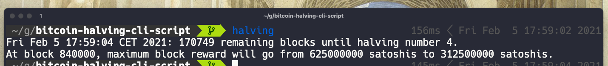

bitcoin-halving-cli-script
==========================
Gets the last bitcoin block count from https://blockchain.info/q/getblockcount and calculates the remaining blocks until the next halving.

Installation
------------
```sh
git clone https://github.com/alfonmga/bitcoin-halving-cli-script
cd bitcoin-halving-cli-script
chmod +x main
./main
```
Example screenshot
------------------

